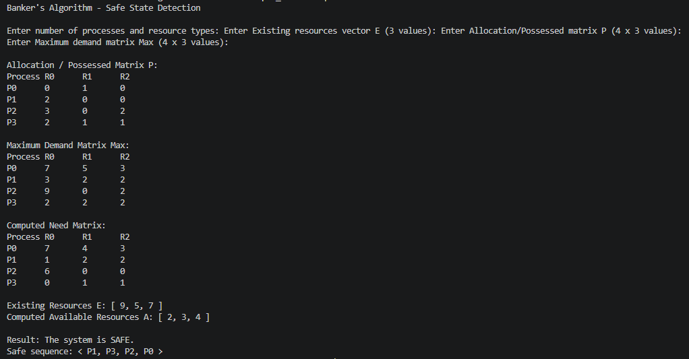
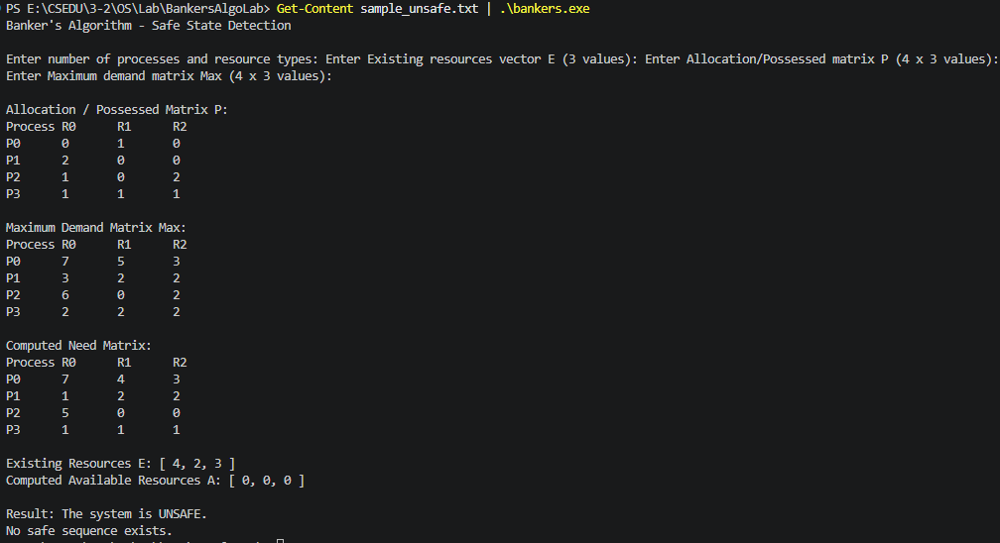

# Banker's Algorithm Lab

Name: Abu Bakar Siddique  
Language: C  
Topic: Banker's Algorithm for safe state detection

## Objective

This program implements the Banker's Algorithm. It checks whether the current resource allocation state is **safe** or **unsafe**.

A system is safe if there is at least one order of process execution where every process can finish and release its resources.

## Files

| File | Purpose |
|---|---|
| `bankers.c` | Main C program. All logic is written inside `int main(void)` with side-by-side comments. |
| `sample_safe.txt` | Input from the lab manual. It should produce a safe sequence. |
| `sample_unsafe.txt` | Extra test case that should produce an unsafe result. |
| `safe.png` | Screenshot of the safe sample output. |
| `unsafe.png` | Screenshot of the unsafe sample output. |
| `bankers_algorithm_manual.pdf` | Lab manual provided by sir. |

## Input Format

The program reads input in this order:

```text
n m
Existing resources vector E
Allocation / Possessed matrix P
Maximum demand matrix Max
```

Meaning:

| Symbol | Meaning |
|---|---|
| `n` | Number of processes |
| `m` | Number of resource types |
| `E[j]` | Total existing instances of resource `Rj` |
| `Allocation[i][j]` | Resource `Rj` currently allocated to process `Pi` |
| `Max[i][j]` | Maximum amount of resource `Rj` process `Pi` may request |
| `Need[i][j]` | Remaining resources process `Pi` may still need |
| `Available[j]` | Resources of type `Rj` currently free |

## Manual Example Input

This is stored in `sample_safe.txt`.

```text
4 3
9 5 7
0 1 0
2 0 0
3 0 2
2 1 1
7 5 3
3 2 2
9 0 2
2 2 2
```

Explanation:

- `4 3` means 4 processes and 3 resource types.
- `9 5 7` means Existing resources `E = [9, 5, 7]`.
- Next 4 rows are the Allocation matrix.
- Last 4 rows are the Maximum demand matrix.

## Compile and Run

Open terminal in:

```powershell
E:\CSEDU\3-2\OS\Lab\BankersAlgoLab
```

Compile:

```powershell
gcc bankers.c -o bankers.exe
```

Run safe sample in PowerShell:

```powershell
Get-Content sample_safe.txt | .\bankers.exe
```

Run unsafe sample:

```powershell
Get-Content sample_unsafe.txt | .\bankers.exe
```

If using Linux/Git Bash:

```sh
gcc bankers.c -o bankers
./bankers < sample_safe.txt
```

## Expected Safe Output

For the manual example, important output:

```text
Computed Available Resources A: [ 2, 3, 4 ]
Result: The system is SAFE.
Safe sequence: < P1, P3, P2, P0 >
```

Screenshot:



This screenshot shows that the program correctly computes the Need matrix, computes `Available = [2, 3, 4]`, detects a safe state, and prints the safe sequence `< P1, P3, P2, P0 >`.

## Expected Unsafe Output

For `sample_unsafe.txt`, important output:

```text
Result: The system is UNSAFE.
No safe sequence exists.
```

Screenshot:



This screenshot shows a case where the initial `Available` resources are not enough for any unfinished process to safely complete, so the program correctly reports that no safe sequence exists.

## Code Documentation

The complete implementation is in `bankers.c` inside `int main(void)`.

### Header and constants

```c
#include <stdio.h>
#include <stdbool.h>
#define MAX_PROCESSES 20
#define MAX_RESOURCES 20
```

- `stdio.h` is used for `printf` and `scanf`.
- `stdbool.h` is used for `bool`, `true`, and `false`.
- `MAX_PROCESSES` and `MAX_RESOURCES` fix maximum array sizes.

### Main variables

```c
int existing[MAX_RESOURCES];
int allocation[MAX_PROCESSES][MAX_RESOURCES];
int max_demand[MAX_PROCESSES][MAX_RESOURCES];
int need[MAX_PROCESSES][MAX_RESOURCES];
int available[MAX_RESOURCES];
int work[MAX_RESOURCES];
int safe_sequence[MAX_PROCESSES];
bool finish[MAX_PROCESSES] = { false };
```

What they do:

- `existing` stores total resources in the system.
- `allocation` stores currently allocated resources.
- `max_demand` stores maximum demand.
- `need` is computed using `Max - Allocation`.
- `available` is computed using `Existing - allocated column sum`.
- `work` is a temporary copy of `available` used during the safety check.
- `safe_sequence` stores the safe process order.
- `finish` marks whether a process can complete.

### Input validation

The code checks:

- process/resource count is within limit
- resources are not negative
- `Max[i][j] >= Allocation[i][j]`
- allocated resources do not exceed existing resources

This prevents invalid states from producing wrong output.

### Available calculation

Formula:

```text
Available[j] = Existing[j] - sum(Allocation[i][j])
```

Code idea:

```c
allocated_sum += allocation[i][j];
available[j] = existing[j] - allocated_sum;
```

For the manual example:

```text
Allocation column sums = [7, 2, 3]
Existing E = [9, 5, 7]
Available A = [9-7, 5-2, 7-3] = [2, 3, 4]
```

### Need calculation

Formula:

```text
Need[i][j] = Max[i][j] - Allocation[i][j]
```

Example:

```text
P1 Allocation = [2, 0, 0]
P1 Max        = [3, 2, 2]
P1 Need       = [1, 2, 2]
```

### Safety algorithm

The algorithm starts with:

```text
Work = Available
Finish[i] = false for all processes
```

Then it repeatedly searches for a process `Pi` such that:

```text
Need[i][j] <= Work[j] for every resource type j
```

If the condition is true, `Pi` can finish. After finishing, it releases its resources:

```text
Work[j] = Work[j] + Allocation[i][j]
```

The process is added to the safe sequence.

If all processes finish:

```text
System is SAFE
```

If no unfinished process can run in a full pass:

```text
System is UNSAFE
```

## Manual Example Walkthrough

Initial:

```text
Available / Work = [2, 3, 4]
```

Process checks:

| Step | Work before | Process selected | Need | Work after release |
|---|---|---|---|---|
| 1 | `[2, 3, 4]` | `P1` | `[1, 2, 2]` | `[4, 3, 4]` |
| 2 | `[4, 3, 4]` | `P3` | `[0, 1, 1]` | `[6, 4, 5]` |
| 3 | `[6, 4, 5]` | `P2` | `[6, 0, 0]` | `[9, 4, 7]` |
| 4 | `[9, 4, 7]` | `P0` | `[7, 4, 3]` | `[9, 5, 7]` |

Safe sequence:

```text
< P1, P3, P2, P0 >
```

Final `Work` becomes equal to `Existing`, meaning all resources were eventually released.

## Output Requirements Covered

The program prints:

1. Computed Need matrix
2. Computed Available vector
3. Whether the system is safe or unsafe
4. Safe sequence if the system is safe
5. No safe sequence message if unsafe

## Detailed Code Walkthrough

This section explains the program using the same variable names used in `bankers.c`.

### 1. Program starts

```c
int main(void)
```

Everything is inside `main()`. When the program runs, execution starts from the first line inside `main`.

### 2. Process and resource count

```c
int n, m;
```

- `n` = number of processes
- `m` = number of resource types

Example:

```text
4 3
```

This means:

- `n = 4`, so processes are `P0, P1, P2, P3`
- `m = 3`, so resource types are `R0, R1, R2`

### 3. Main arrays

```c
int existing[MAX_RESOURCES];
```

This stores total resources in the system.

Example:

```text
existing = [9, 5, 7]
```

Meaning:

- total `R0 = 9`
- total `R1 = 5`
- total `R2 = 7`

```c
int allocation[MAX_PROCESSES][MAX_RESOURCES];
```

This stores how many resources each process already has.

Example:

```text
P1 allocation = [2, 0, 0]
```

This means `P1` already holds 2 of `R0`, 0 of `R1`, and 0 of `R2`.

```c
int max_demand[MAX_PROCESSES][MAX_RESOURCES];
```

This stores the maximum demand of each process.

Example:

```text
P1 max = [3, 2, 2]
```

This means `P1` may need at most 3 of `R0`, 2 of `R1`, and 2 of `R2`.

```c
int need[MAX_PROCESSES][MAX_RESOURCES];
```

This stores remaining need.

Formula:

```c
need[i][j] = max_demand[i][j] - allocation[i][j];
```

For `P1`:

```text
need[1][0] = max_demand[1][0] - allocation[1][0]
           = 3 - 2
           = 1
```

So:

```text
Need P1 = [1, 2, 2]
```

```c
int available[MAX_RESOURCES];
```

This stores currently free resources.

```c
int work[MAX_RESOURCES];
```

This is a temporary copy of `available`.

Important difference:

- `available` is the real initial free resources
- `work` is changed during the safety simulation

```c
int safe_sequence[MAX_PROCESSES];
```

This stores the safe process order.

Example:

```text
safe_sequence = [1, 3, 2, 0]
```

The program prints this as:

```text
< P1, P3, P2, P0 >
```

```c
bool finish[MAX_PROCESSES] = { false };
```

This stores whether a process has already finished in the simulation.

At first:

```text
finish[0] = false
finish[1] = false
finish[2] = false
finish[3] = false
```

After `P1` finishes:

```text
finish[1] = true
```

### 4. Reading input

```c
scanf("%d %d", &n, &m);
```

This reads the number of processes and resource types.

Then:

```c
scanf("%d", &existing[j]);
```

This reads the `existing[]` vector.

Then:

```c
scanf("%d", &allocation[i][j]);
```

This reads the Allocation matrix.

Then:

```c
scanf("%d", &max_demand[i][j]);
```

This reads the Max matrix.

### 5. Validation checks

```c
if (n <= 0 || n > MAX_PROCESSES || m <= 0 || m > MAX_RESOURCES)
```

This checks whether the entered sizes fit inside the arrays.

```c
if (existing[j] < 0)
```

This prevents negative total resources.

```c
if (allocation[i][j] < 0)
```

This prevents negative allocation.

```c
if (max_demand[i][j] < allocation[i][j])
```

This is important because a process cannot already hold more than its maximum demand.

Invalid example:

```text
Allocation = 5
Max = 3
```

This is impossible, so the program stops.

### 6. Compute Available

Code:

```c
for (int j = 0; j < m; j++) {
    int allocated_sum = 0;

    for (int i = 0; i < n; i++) {
        allocated_sum += allocation[i][j];
    }

    available[j] = existing[j] - allocated_sum;
}
```

The outer loop goes resource by resource.

For `j = 0`, it computes available `R0`.

Manual Allocation matrix:

```text
P0: 0 1 0
P1: 2 0 0
P2: 3 0 2
P3: 2 1 1
```

For `R0`, column values are:

```text
0 + 2 + 3 + 2 = 7
```

So:

```text
available[0] = existing[0] - allocated_sum
available[0] = 9 - 7
available[0] = 2
```

For `R1`:

```text
1 + 0 + 0 + 1 = 2
available[1] = 5 - 2 = 3
```

For `R2`:

```text
0 + 0 + 2 + 1 = 3
available[2] = 7 - 3 = 4
```

Final:

```text
available = [2, 3, 4]
```

### 7. Compute Need

Code:

```c
for (int i = 0; i < n; i++) {
    for (int j = 0; j < m; j++) {
        need[i][j] = max_demand[i][j] - allocation[i][j];
    }
}
```

The outer loop `i` goes process by process. The inner loop `j` goes resource by resource.

For `P0`:

```text
Max P0        = [7, 5, 3]
Allocation P0 = [0, 1, 0]
Need P0       = [7-0, 5-1, 3-0]
              = [7, 4, 3]
```

For `P1`:

```text
Max P1        = [3, 2, 2]
Allocation P1 = [2, 0, 0]
Need P1       = [1, 2, 2]
```

For `P2`:

```text
Max P2        = [9, 0, 2]
Allocation P2 = [3, 0, 2]
Need P2       = [6, 0, 0]
```

For `P3`:

```text
Max P3        = [2, 2, 2]
Allocation P3 = [2, 1, 1]
Need P3       = [0, 1, 1]
```

### 8. Initialize Work

Code:

```c
work[j] = available[j];
```

So:

```text
available = [2, 3, 4]
work      = [2, 3, 4]
```

The program uses `work` because `available` is the real starting value, while `work` changes during the simulation.

### 9. Safety algorithm loop

Main loop:

```c
while (completed < n)
```

This means the program keeps searching until all processes are completed.

At first:

```text
completed = 0
n = 4
```

So the loop runs.

Inside:

```c
bool found_process = false;
```

This means no process has been found in this round yet.

Then:

```c
for (int i = 0; i < n; i++)
```

This checks every process from `P0` to `P3`.

### 10. Skip finished process

```c
if (finish[i]) {
    continue;
}
```

If a process is already completed, the program skips it.

Example after `P1` completes:

```text
finish[1] = true
```

The next time the loop reaches `P1`, it is skipped.

### 11. Check whether process can finish

Code:

```c
bool can_finish = true;

for (int j = 0; j < m; j++) {
    if (need[i][j] > work[j]) {
        can_finish = false;
        break;
    }
}
```

This checks:

```text
Need[i] <= Work
```

For all resource types.

Initial:

```text
work = [2, 3, 4]
```

Check `P0`:

```text
need[0] = [7, 4, 3]
```

Compare:

```text
7 <= 2 ? false
```

So:

```c
can_finish = false;
break;
```

`P0` cannot finish now.

Check `P1`:

```text
need[1] = [1, 2, 2]
work    = [2, 3, 4]
```

Compare:

```text
1 <= 2 true
2 <= 3 true
2 <= 4 true
```

So `can_finish` stays true.

### 12. If a process can finish

Code:

```c
if (can_finish) {
    for (int j = 0; j < m; j++) {
        work[j] += allocation[i][j];
    }

    finish[i] = true;
    safe_sequence[completed] = i;
    completed++;
    found_process = true;
}
```

For `P1`:

```text
allocation[1] = [2, 0, 0]
work = [2, 3, 4]
```

After `P1` releases resources:

```text
work[0] = 2 + 2 = 4
work[1] = 3 + 0 = 3
work[2] = 4 + 0 = 4
```

Now:

```text
work = [4, 3, 4]
```

Then:

```c
finish[1] = true;
```

This marks `P1` complete.

```c
safe_sequence[completed] = i;
```

Since `completed = 0` and `i = 1`:

```text
safe_sequence[0] = 1
```

Then:

```c
completed++;
```

Now:

```text
completed = 1
```

And:

```c
found_process = true;
```

This means this pass made progress.

### 13. Full manual sequence

Initial:

```text
work = [2, 3, 4]
```

`P1` can finish.

After `P1`:

```text
work = [4, 3, 4]
safe_sequence = [1]
```

Now `P3` can finish:

```text
need[3] = [0, 1, 1]
work    = [4, 3, 4]
```

After `P3` releases:

```text
allocation[3] = [2, 1, 1]
work = [4+2, 3+1, 4+1]
work = [6, 4, 5]
safe_sequence = [1, 3]
```

Now `P2` can finish:

```text
need[2] = [6, 0, 0]
work    = [6, 4, 5]
```

After `P2` releases:

```text
allocation[2] = [3, 0, 2]
work = [6+3, 4+0, 5+2]
work = [9, 4, 7]
safe_sequence = [1, 3, 2]
```

Now `P0` can finish:

```text
need[0] = [7, 4, 3]
work    = [9, 4, 7]
```

After `P0` releases:

```text
allocation[0] = [0, 1, 0]
work = [9+0, 4+1, 7+0]
work = [9, 5, 7]
safe_sequence = [1, 3, 2, 0]
```

Now:

```text
completed = 4
n = 4
```

So:

```c
while (completed < n)
```

becomes false, and the loop stops.

### 14. Unsafe detection

This code handles unsafe state:

```c
if (!found_process) {
    is_safe = false;
    break;
}
```

If one full pass checks all unfinished processes and none can finish, the system is unsafe.

Example:

```text
work = [0, 0, 0]
```

If every process needs something more than `[0, 0, 0]`, no process can finish.

Then:

```text
found_process = false
is_safe = false
```

Output:

```text
Result: The system is UNSAFE.
No safe sequence exists.
```

### 15. Printing final output

If safe:

```c
if (is_safe) {
    printf("Result: The system is SAFE.");
}
```

Then it prints each process:

```c
printf("P%d", safe_sequence[i]);
```

If:

```text
safe_sequence = [1, 3, 2, 0]
```

Output becomes:

```text
< P1, P3, P2, P0 >
```

If unsafe:

```c
else {
    printf("Result: The system is UNSAFE.");
    printf("No safe sequence exists.");
}
```

### Final viva explanation

> My program first reads `Existing`, `Allocation`, and `Max`. Then it computes `Available` using `Existing - allocated column sum`, and computes `Need` using `Max - Allocation`. After that, it copies `Available` into `Work`. The safety loop repeatedly searches for a process whose `Need` is less than or equal to `Work`. If found, that process is assumed to finish, so its `Allocation` is added back to `Work`, and the process number is stored in `safe_sequence`. If all processes finish, the system is safe. If no process can finish in a full pass, it is unsafe.

## Viva Q&A

**Q: What is the Banker's Algorithm?**  
A: It is a deadlock avoidance algorithm. It checks whether the system can still complete all processes safely.

**Q: What is a safe state?**  
A: A safe state means there exists at least one sequence where all processes can finish.

**Q: Does unsafe mean deadlock has already happened?**  
A: No. Unsafe means deadlock may happen because no guaranteed safe sequence exists.

**Q: Why do we compute Need?**  
A: Need tells how many more resources each process may still request before it can finish.

**Q: How do we compute Need?**  
A: `Need = Max - Allocation`.

**Q: How do we compute Available?**  
A: `Available = Existing - sum of Allocation columns`.

**Q: What is Work?**  
A: Work is a temporary vector used by the algorithm to simulate available resources as processes finish.

**Q: Why do we add Allocation back to Work?**  
A: Because when a process finishes, it releases all resources it was holding.

**Q: What does `finish[i]` mean?**  
A: It means process `Pi` has been safely completed in the simulated sequence.

**Q: Why is the sample safe?**  
A: Because the program finds this valid order: `< P1, P3, P2, P0 >`.

**Q: What if no process can finish in one full loop?**  
A: The state is unsafe because the algorithm cannot build a safe sequence.
